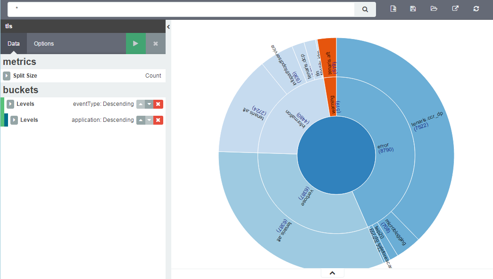

# Kibana Sunburst Visualization Plugin

This is a Sunburst diagram visType for Kibana, version 4.4.1.

This plugin is based on the excelent work done by @chenryn with the
kbn_sankey_vis [plugin](https://github.com/chenryn/kbn_sankey_vis) (Thanks!), and of course on the exceptional D3 library,
by @mbostock [D3 Gallery](https://github.com/mbostock/d3/wiki/Gallery) (Also, Thanks!).



##Installation Steps

(Theses are optional, you can just copy the kbn_sunburst_vis folder into
KIBANA_HOME/src/plugins) and run kibana.

```
git clone https://github.com/JuanCarniglia/kbn_sunburst_vis.git 
cd kbn_sunburst_vis
npm install
npm run build
cp -R build/kbn_sunburst_vis/ KIBANA_HOME/installedPlugins
```

##How does it work

Basically, this plugin takes the information from Elasticsearch, generates a JSON structure similar to
what is expected by the D3 Sunburst code, which is:

```json
{
  "name": "flare",
  "children": [
    {
      "name": "something",
      "children": [
        {
          "name": "some_other",
          "children": null,
          "size": 138
        },
        {
          "name": "some_other_other",
          "children": null,
          "size": 305
        }
      ],
      "size": 443
    }
  ]
}
```
And generates two levels of Arcs. One root, and two other levels, to be exact.

The radius of the arcs are related to the "size" value.
